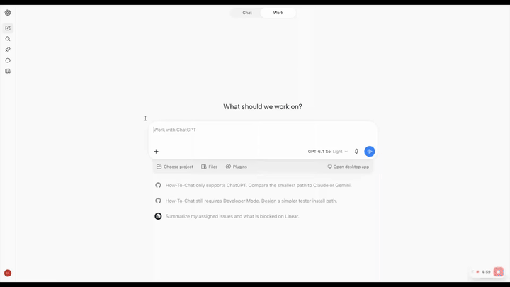
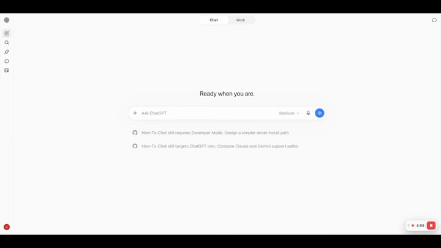
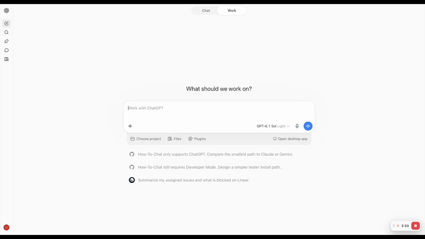

<p align="center">
  
</p>

# How-To-Chat

A Chrome extension that reads your prompt before you send it and tells you, in plain language, when the answer you're about to get might be less honest or less safe than you think.

It runs entirely in your browser. Nothing you type is sent anywhere else.

## Why this matters

If a friend or family member has ever told you "ChatGPT said this" or "ChatGPT agreed with me," you've probably learned to ask the follow-up: what did you actually ask it, and how did you phrase it? How you ask shapes what you get back, and most people have no reason to know that.

People ask ChatGPT for medical, financial, and relationship advice and trust the answer like it came from a professional who knows them. Two things make that risky:

1. **The model tends to agree with you.** Research on LLM sycophancy shows phrasing alone changes how much a model agrees, independent of whether you're right. "I'm sure X is true" gets confirmed more often than "is X true?", a pattern across models, not a bug in one.
2. **Some questions carry real stakes no matter how they're asked.** "Can I take an extra dose if I forgot this morning's?" is dangerous to get wrong regardless of phrasing.

Most people don't have someone looking over their shoulder when they're chatting with an AI at 11pm about their prescription or their retirement account, and asking them about it afterward is too late. This extension is built to be that voice for them: the "wait, what did you actually ask it" question, asked automatically, before they hit send.

## The dangers it's trying to catch

**The main one: a leading question.** How you ask shapes the answer you get. "I think my son's ADHD meds are doing more harm than good, what are the signs they aren't working?" invites a one-sided answer. "Be my hype man and tell me quitting my job to stream full-time is a great plan" assigns the model a role that can't push back. None of these are lies, they just make agreement the path of least resistance, and that's the pattern this extension catches.

**A narrower case: high-stakes, hard-to-undo actions.** A few specific actions get flagged regardless of phrasing, because a wrong answer is expensive to undo: medication dosing, money transfers, signing a legal or financial document. Mention that a doctor, pharmacist, banker, or lawyer already reviewed the specific action, and the extension backs off.

It also has a narrower, experimental check for scam narratives relayed from a third party (a caller claiming to be a relative or a bank, asking for gift cards or a wire transfer under pressure). This is a smaller, less certain part of the project. The core focus is framing, not fraud detection.

## What the extension is

A Chrome extension for chatgpt.com. It watches the chat input as you type, runs two independent checks against the text, and shows a small badge near the input box if something's worth a second look. Click the badge for a one-line tip. It never edits your prompt and never blocks sending, a flag is information, not a gate.

## See it in action

A leading medical question gets an amber badge: cue 1, asserting a stance as settled fact.



Pushing back on an honest answer without a new reason gets flagged too: cue 5, tracked across the conversation.



A grandparent scam narrative gets a red safety badge, which takes priority over framing cues.



## What it's looking for

Two separate things, checked independently:

**Framing cues (the main mechanism).** How you're asking, not what you're asking about. Twelve patterns, drawn from sycophancy research, where the way a prompt is phrased tends to pull the model toward agreement instead of an honest read: asserting a stance as settled fact, appealing to what "everyone knows" or what an authority already said, assigning the model a supportive role ("be my hype man"), presenting only one side of a story, and others documented in [`docs/taxonomy.md`](docs/taxonomy.md).

**Safety flags (a narrower add-on).** A small, separate set of checks on what the prompt involves rather than how it's phrased: a **stakes** flag for medication dosing, money transfers, and legal signing, and an experimental **scam narrative** flag for third-party stories with signs of fraud (urgency, secrecy, an unusual payment channel, an unfamiliar relative or authority). Documented in [`docs/safety.md`](docs/safety.md); scope and future here are still under discussion.

Safety flags get a red badge instead of amber and take priority when both fire.

## How it works

A content script watches the chat editor for input (debounced, since ChatGPT's editor doesn't fire normal input events on every change) and re-attaches automatically if the page swaps the editor out from under it. On each change, two detectors run against the current text:

- `detector.js` checks the 12 framing cues
- `safety-detector.js` checks the stakes and scam-narrative flags

Both are regex and keyword heuristics today, no model call, no network request. If either fires, an overlay renders a badge and popover in an isolated shadow root, so the extension never touches the page's own DOM beyond one host element and the site's CSS can't bleed into it or vice versa.

**What v0 does not do yet.** The heuristics catch phrasing patterns but don't reason about whether the flagged cue is load-bearing for the question asked (tracked in [issue #2](../../issues/2)). It only runs on chatgpt.com; Claude and Gemini support is planned but not built ([issue #20](../../issues/20), [issue #21](../../issues/21)). Precision is the priority over recall, since a false flag costs more than a missed one: over-flagging is what gets an extension uninstalled.

## Installing it locally

Not published to the Chrome Web Store yet. To load it unpacked for local testing:

1. Clone this repo.
2. Open `chrome://extensions` in Chrome.
3. Turn on **Developer mode** (top right).
4. Click **Load unpacked** and select the `extension/` folder.
5. Open chatgpt.com and start typing in the chat box.

## Repo map

| Path | Contents |
|---|---|
| `docs/research.md` | Papers, key findings, caveats |
| `docs/taxonomy.md` | The 12 framing cues, the flag rule, exemptions, user-facing tips |
| `docs/safety.md` | The stakes and scam-narrative safety flags, the safety rule |
| `docs/architecture.md` | Extension design and the reasoning behind it |
| `docs/decisions.md` | Dated decision log |
| `docs/demo-script.md` | Demo video shot list, prompts, and captions |
| `data/schema.json` | Eval record format for the 12 framing cues |
| `data/schema_safety.json` | Eval record format for the safety flags |
| `data/sources.md` | External datasets, what each covers, how to fetch |
| `data/seed/` | Hand-written, reviewed eval examples |
| `data/external/` | Downloaded datasets (gitignored) |
| `scripts/` | Fetch and adapter scripts |
| `eval/` | Eval harness and results |
| `extension/` | Chrome extension |
| `media/demo/` | Recorded demo clips (full + speed) and the GIFs used above |

## Getting the external data

```
./scripts/fetch_external.sh
```

See `data/sources.md` for datasets that need a manual download.
